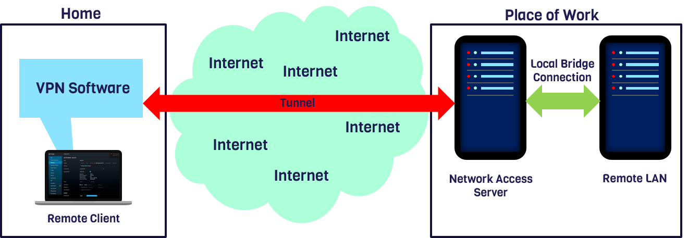

# SSH-Remote-Access-VPN
A Remote access virtual private network using SSH. Having 3 main components, Remote LAN, Network Access Server and Client. The concept used was remote Port forwarding using SSH. Currently the application supports only a CLI interface, as the GUI config is still in work. 

Vagrant Containers were used to Set up the Remote LAN.

An AWS EC2 instance was used to setup the Network access server to listen to incoming connections. (Now been brought offline)

Client application to connect to the NAS and thereby the Remote LAN.
